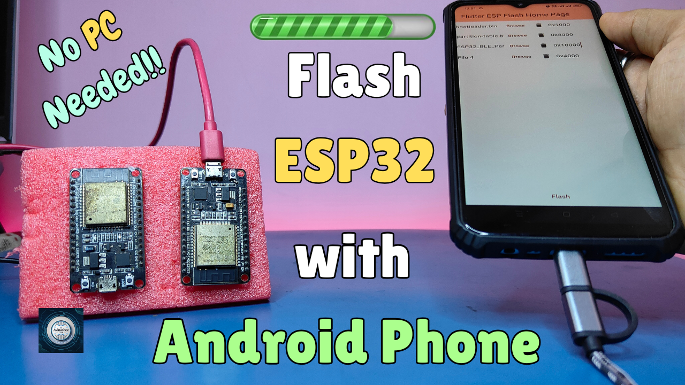

<h1 align="center">
  <a href="https://www.youtube.com/@eccentric_engineer">
	
  </a>  
</h1>

<h3 align="center">
	Flash ESP32 Using Your Phone
</h3>


  
## 📝 Overview

Easily flash your ESP32 directly from an Android phone with flasher App — no PC needed!  
This repo contains firmware BIN files which can be used to flash your ESP32 module following 
instructions in the YouTube video.

Platform used for firmware development is ESP-IDF on VSCode.  
Learn more 👇👇  
  
[](https://youtu.be/dnqMeG-Z8XE?si=KjaaAesvRtFkmxoL)

## ✔️ Requirements

### 📦 Hardware
- ESP32 Devkit V1 (main controller board)
- USB Micro Cable
- Android Phone (to flash ESP32 using app)
- OTG Cable

### 📂 Software
- VSCode (https://code.visualstudio.com/)  
- ESP-IDF (https://docs.espressif.com/projects/vscode-esp-idf-extension/en/latest/installation.html)
- ESP32_Flash app for Android Device (https://play.google.com/store/apps/details?id=com.esp_flash.esp_flash_app)
- nRF Connect for Mobile App (https://play.google.com/store/apps/details?id=no.nordicsemi.android.mcp)

## 🛠️ Flashing Steps

```sh
Download Repo Zip File on your Android Phone
Extract file and Download ESP32_Flash App from Playstore
Open App -> Select Device as ESP32 -> Select Files and Enter Flash Address as specified in Video
Connect your ESP32 using OTG cable and micro usb to your Phone
Go to Android Settings -> search for OTG -> Enable OTG connection
Hit Flash button on the App (Press Boot button on ESP32 board, if needed)
Once Flash is completed -> Press En or Reset button on board to see the action 
Enjoy...🍹
```
For Bluetooth Example
```sh
After following above steps -> Download nRF Connect for Mobile App from Playstore
Turn on Bluetooth and Location on your Device
Open the App and Tap on Scan in the top right corner
Your Bluetooth device Avinashee_Tech would be ready 
Enjoy...🍹
```

## ⭐️ Show Your Support

If you find this helpful or interesting, please consider giving us a star on GitHub. Your support helps promote the project and lets others know that it's worth checking out. 

Thank you for your support! 🌟

[](https://github.com/AvinasheeTech/ESP32-phone-flasher/stargazers)
